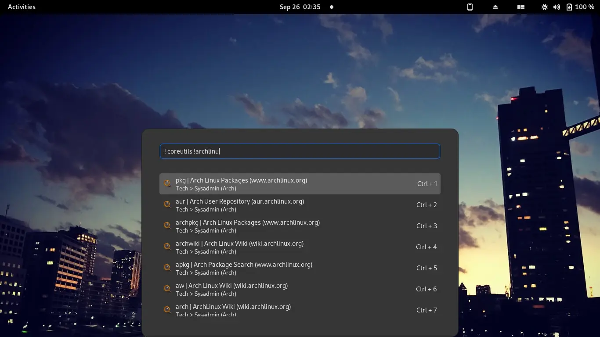
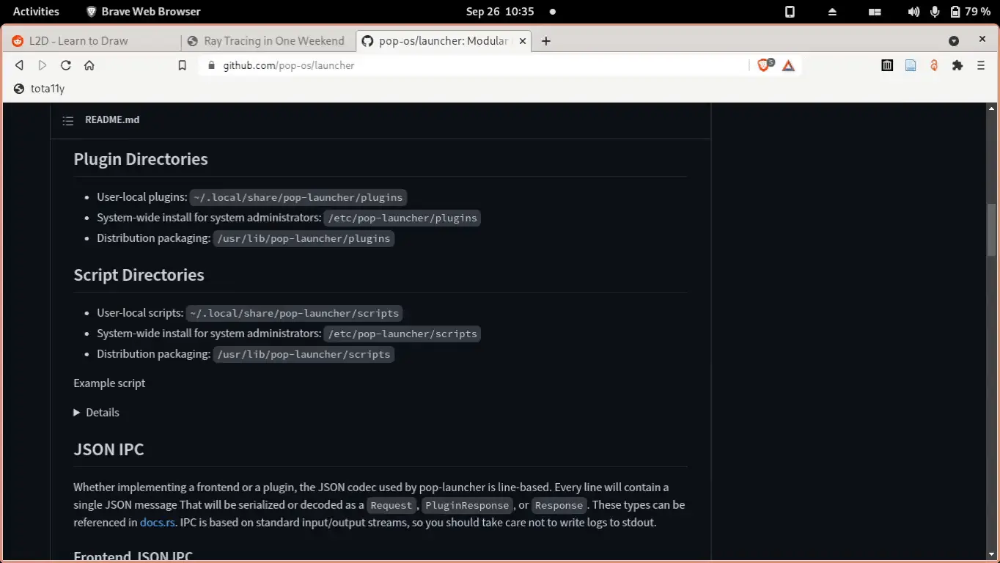

= Pop launcher bangs plugin
:toc:

:prefix_query: !
:bangs_search_query_prefix: !

A link:https://github.com/pop-os/launcher[Pop launcher plugin] that provides a quick searching interface with link:https://duckduckgo.com/bang[Duckduckgo bangs].

== Prerequisites

You need the following dependencies installed if you want to build it from scratch.

* link:https://git-scm.com/[Git] (obvs)
* link:https://www.rust-lang.org/[Rust compiler] with the complete toolchain (e.g., Cargo, clippy, rustfmt, rust-analyzer)
* GNU Make (optional)
* If you have link:http://nixos.org/[Nix package manager] installed, you can simply invoke `nix-shell` and you're done setting up the development environment!

Once you have the dependencies for building in place, you have to do the following.

* Compile the plugin with the package manager (e.g., `cargo build`) and move the binary to one of the launcher plugin paths (e.g., `$HOME/.local/share/pop-launcher/plugins/${PLUGIN}`).

* Move `src/plugin.ron` since Pop launcher needs it to recognize it as one of the plugins in the same plugin directory as the binary.

* You also need to download the bangs database, preferably from Duckduckgo and put it under the `bangs` plugin folder with the filename `db.json`.
However, this step is not needed as the plugin can automatically download the database into the appropriate location at the home directory.

This is also automated with `make install` if you have GNU Make installed.

Once you have built the plugin, you need the following runtime dependencies:

* link:https://github.com/pop-os/launcher[Pop launcher], obviously. :)
* link:https://curl.se/[curl] for handling automatic downloading of Duckduckgo's bang database when there's no such file.
* `xdg-open` for opening URLs.

== How to use?

They say a picture is a thousand words so here's a screenshot of the plugin in the Pop shell launcher frontend.

However, a thousand pictures that simulates movement must be equal to hundred thousand words, yes?
So here's a video demo of using the plugin.

ifdef::env-github[]

endif::[]

ifndef::env-github[]
video::./docs/assets/demo.mp4[width=600px]
endif::[]

I believe that already explains what's the plugin is about.
Feel free to skip at this point.
But if you want text, you may continue.

With the plugin in place, prefix the search query with `{prefix_query}` to activate the plugin.
The plugin has a certain format to follow to do its thing.

[source]
----
! ${SEARCH_QUERY}...
----

The search query should have at least one bang for it to work (unless you've set `default_bangs` from the <<Plugin-specific configuration>>).

You can search bangs within the search query by prepending it with `{bangs_search_query_prefix}`.
The plugin will only give search results if a bang is the last part of the search query.

Here's how to search in Arch Wiki...

[source]
----
! hello there !aw
----

The plugin can open several pages too if you have several bangs in the query.
Let's say we want to search in multiple wiki pages such as the Arch Wiki, Gentoo Wiki, and Duckduckgo just in case we want a generic search result.
Take note this should also give search results in our latest bang (`gw`) from the bang query.

[source]
----
! hello !ddg world !aw !gw
----

This plugin should have the following list of features:

* Upon activation, the plugin will open each of the URL and close.
* The plugin has a tab completion which will replace the latest bang with the selected bang into the bang query.

=== Plugin-specific configuration

This plugin has a configuration file it can use to change some of its behaviors.
The configuration file should be in `$POP_PLUGIN_PATH/bangs/config.json`.
It is a simple JSON object with the possible keys and their values.

[%header, cols="3*"]
|===
| Key
| Value
| Default value

| `db_url`
| A string to the fallback URL for the bangs database.
| `https://duckduckgo.com/bang.js`

| `max_limit`
| A number that dictates how many search results should the plugin return at maximum.
| 8

| `force_download`
| Indicates whether or not the fallback database should be downloaded forcibly.
This will override the database to be downloaded in the home directory.
Be careful as this will override already existing database files and will download each time the plugin is invoked.
Don't enable this unless you have good and unlimited internet connection.
| `false`

| `default_bangs`
| A list of bangs to be used when no bangs from the search query was found.
| empty array

| `unique_bangs`
| Indicates whether to remove bangs with duplicate URLs.
Very helpful if you don't want aliases to clutter your search result.
| `false`
|===

This is the equivalent JSON for the default configuration.

[source, json]
----
{
    "db_url": "https://duckduckgo.com/bang.js",
    "max_limit": 8,
    "force_download": false,
    "unique_bangs": false,
    "default_bangs": []
}
----

== Setting up for development

This project is pretty much just someone's pet project looking for a reason to write Rust.
Nonetheless, a project guideline is a good thing.

* Follow the stable channel of Rust compiler.

* Use the rest of Rust toolchain such as clippy and rustfmt before making a contribution.
`rust-analyzer` is optional (but recommended).

* If you have Nix installed, you should use the stable version of nixpkgs.
If you use unstable version of Nix, you should use the flakes feature.

* Use link:https://asciidoctor.org/[Asciidoctor]-flavored Asciidoc as the preferred text formatting language.
footnote:[Seriously, it's pretty nice. :)]

== Frequently asked questions

[qanda]
What is the difference from the built-in web plugin?::
Among other things, this plugin can search multiple pages with one query and takes advantages of link:https://duckduckgo.com/bang[Duckduckgo's massive list of them] which you can customize it if you want to.
If you think about it, not much.
Both plugins are just getting a list of web search engines from a database, attaching your input to their respective URLs, and opening them with `xdg-open`.
In fact, much of this plugin's source code is based from the web plugin (in other words, it's more like a fork than something else).

Is the database file used by the plugin in the filesystem?::
The database file is just Duckduckgo's bangs database placed in `$POP_PLUGIN_PATH/bangs/db.json` — e.g., `~/.local/pop-launcher/plugins/bangs/db.json` if you've installed it locally.
You can customize it if you want to, add or remove some bangs if you're impatient for the submission process (like me).
You can start by formatting the database file nicely — e.g., `jq . https://duckduckgo.com/bang.js > $POP_PLUGIN_PATH/bangs/db.json` then edit with your text editor of choice.

Why this project exists?::
As an excuse to write something in Rust along with the perfect timing of Pop launcher being rewritten in it.
As for whether this project is useful or not, that's on you.
To be honest, I rarely use this plugin myself but it is handy on certain situations such as searching within similar topics (e.g., `! !da !ao3 !pixiv !twit ART`, `! !gh !glab CODE`, `! !rgate !arx !hal RESEARCH_TOPIC`).
It'll be more useful once this project continues to be develop which you can freely contribute if you're bored of waiting. ;p

== Future considerations

* Make a consistent interface similar to the built-in plugins.
The way how a user can interact with the plugin is slightly different compared to them — e.g., you have to press 'Enter' to open the URLs instead of adding them.
If possible, it should be moved into some other keybindings to finalize and open the query.
footnote:[Seems like the `ActivateContext` object can make it possible.]

== Acknowledgements

* Much of the code are copied (READ: stolen) from the https://github.com/pop-os/launcher/tree/master/plugins/src/web[web built-in launcher plugin]. footnote:[This is also why the project is under GPL3.]
* The link:https://github.com/dhelmr/ulauncher-duckduckgo-bangs[Ulauncher Duckduckgo bangs extension] as one of the inspirations for the interface.
